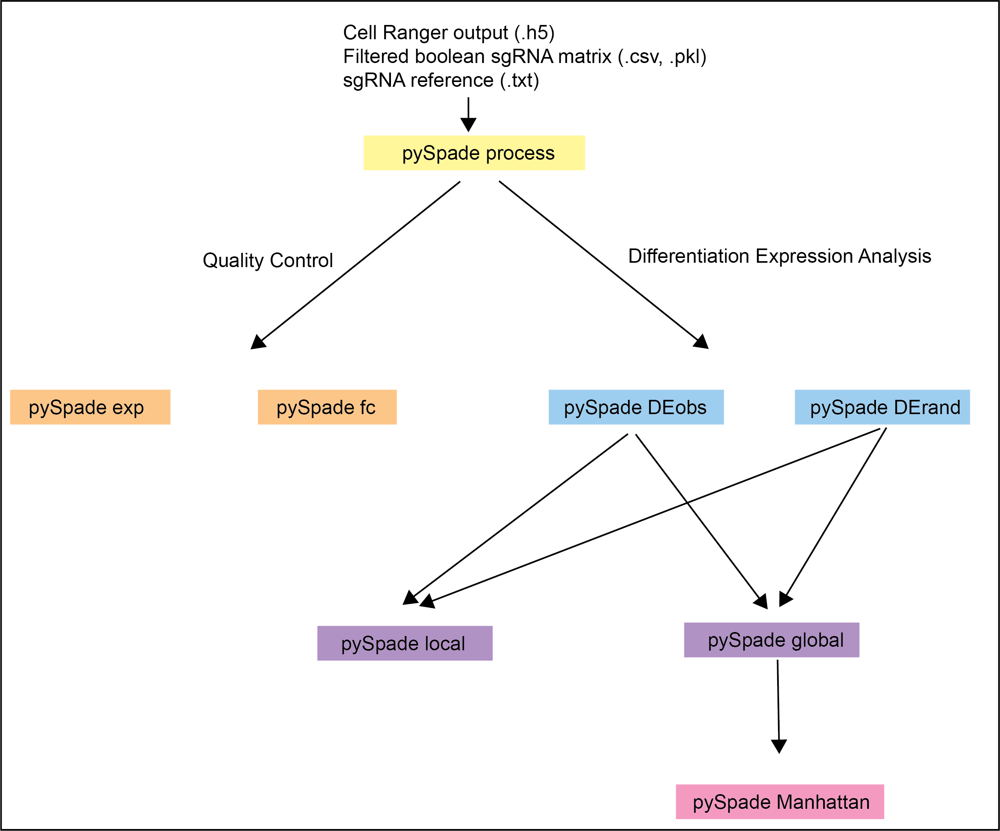

# pySpade: Single cell Perturbations - Analysis of Differential gene Expression

## Overview
_________
`pySpade` performs the whole transcriptome analysis of single cell perturbation datasets. With the direct output of Cellranger, `pySpade` utilizes hypergeomtric test to analyze the whole transcriptome differential expression and generates hits table csv file and Manhattan plots. Currently we support human genome. 

## Requirement
_________
* Python (3.7 +)
* Numpy (1.21 +)
* Pandas (1.3.5 +)
* Scipy (1.6.2 +)
* Matplotlib(3.5+)

## Installation
________
`pySpade` can be installed with `pip`

```shell
pip install pySpade
```

## Usage


________
```
$pySpade
usage: pySpade [-h]  ...

pySpade 
Version: 0.1.2

optional arguments:
  -h, --help  show this help message and exit

functions:
  
    process   process mapping output and reformat for downstream analysis.
    explevel  check the average expression level of query genes in single cell matrix
    fc        check the fold change of sgrna
    DEobs     perform differential expression analysis of observed cells
    DErand    perform differential expression analysis of random selection background
    local     perform local hit analysis with observation data and random background
    global    perform global hit analysis with observation data and random background
    manhattan   generate Manhattan plots for each perturbation region
    
```

* `process` : Process transcriptome output and sgrna output to remove experimental doublets and sgrna outlier cells.
    * Input 1: Transcriptome matrix is from Cellranger output (outs folder).
    * Input 2: sgrna matrix column: cell barcodes consistent with transcriptome matrix, rows: sgrna sequence or sgrna names. The sgrna matrix is already filtered out potential noise sgrna. Boolean values of the sgrna matrix are used for analysis. Acceptable format: pkl or csv.
    * The final output format is h5 file. The final output can be compressed to save disk space, but it may take more time to write the final output file.

```
usage: pySpade process [-h] -f FEATURE_BC -s INPUT_SGRNA [-m CELL_MULTIPLEX] -o OUTPUT_DIRECTORY [-c COMP]

Process transcriptome output and sgrna output to remove experimental doublets. Transcriptome matrix is from Cellranger
output (outs folder),sgrna matrix is from fba output, other accepted format include pkl and csv file.sgrna matrix column:
cell barcodes consistent with transcriptome matrix, rows: sgrna sequence.The final output format is h5 file.

optional arguments:
  -h, --help            show this help message and exit
  -f FEATURE_BC, --feature_bc FEATURE_BC
                        Specify the output folder from cellranger pipeline (outs folder)
  -s INPUT_SGRNA, --sgrna INPUT_SGRNA
                        Specify the sgrna matrix file.Please make sure the barcodes are consistent with transcriptome if
                        there are multiple libraries. File format: pkl or csv
  -m CELL_MULTIPLEX, --cell_multiplex CELL_MULTIPLEX
                        specify the used antibody name in txt file separate with new line. Make sure that the antibody is
                        mapped together with transcriptome. Cellranger is recommended.
  -o OUTPUT_DIRECTORY, --output_directory OUTPUT_DIRECTORY
                        Specify output directory. The output file format will be h5
  -c COMP, --comp COMP  Final h5 file compress or not. "True" or "False", default is False.
```

* `explevel` : Check the average expression level of query genes in single cell matrix.
    * Input 1: processed transcriptome matrix from the `process` output.
    * Input 2: Query genes list has to be txt file, genes are seperated with new line.

```
usage: pySpade explevel [-h] -t TRANSCRIPTOME_DIR -g GENE [-o OUTPUT_FILE]

Check the average expression level of query genes in single cell matrixInput: processed transcriptome matrix from the
process output,query genes list has to be txt file, genes are seperated with new line.

optional arguments:
  -h, --help            show this help message and exit
  -t TRANSCRIPTOME_DIR, --transcriptome_dir TRANSCRIPTOME_DIR
                        specify the directory from process function.
  -g GENE, --gene GENE  specify the query genes.
  -o OUTPUT_FILE, --output_file OUTPUT_FILE
                        specify output file.
```

* `fc` : Check the fold change of perturbed region and individual sgRNA for query region and gene. Good for test if positive controls work. p-value are calculated with Student's t-test.
    * Input 1: processed transcriptome and sgrna matrix from the `process` output
    * Inout 2: sgrna dict file (perturbation region hg38 coordinates and the sgrna name targeting that region. Region and sgrnas separated by tab, and sgrnas separated by comma. The sgrna name must match the index of sgrna matrix.)
    * Example:
	* chr1:1234567-1235067    sg1;sg2;sg3;sg4;sg5
	* chr2:1234567-1235067    sg6;sg7;sg8;sg9;sg10
    * Input 3: Query file, the query region and query test, separate by tab.
    * Example:
	* chr1:1234567-1235067    GENE1
	* chr2:1234567-1235067    GENE2

```
usage: pySpade fc [-h] -t TRANSCRIPTOME_DIR -d DICT -r REGION -o OUTPUT_FOLDER

Check the fold change of perturbed region and individual sgRNA for query region and gene.Input: processed transcriptome
matrix and sgrna matrix from the process output,sgrna dict file: perturbation region hg38 coordinates and the sgrna
sequence targeting that region.Region and sgrnas separated by tab, and sgrnas separated by comma

optional arguments:
  -h, --help            show this help message and exit
  -t TRANSCRIPTOME_DIR, --transcriptome_dir TRANSCRIPTOME_DIR
                        specify the processed transcriptome matrix file
  -d DICT, -dict DICT   specify the sgRNA annotation file: perturbation coordinates (hg38) and the sgRNA name.
  -r REGION, --region REGION
                        specify the query regions and their target genes to calculate repression efficiency.
  -o OUTPUT_FOLDER, --output_folder OUTPUT_FOLDER
                        specify output folder directory.
```

* `DEobs` : Perfrom the genome wide differential expression analysis of all the perturbation regions. 
    * Input 1: processed transcriptome and sgrna matrix from the `process` output
    * Input 2: sgrna dict file (perturbation region hg38 coordinates and the sgrna sequence targeting that region. Region and sgrnas separated by tab, and  sgrnas separated by comma. The sgrna name must match the index of sgrna matrix).
    * Output files: up regulation p-value, downregulation p-value, fold change(compare with all the other cells) and average cpm.
    *  The default background is all the other cells (complement). Self-defined background (ex. cells with non-target sgRNAs) should be described in the sgrna dict file. 
    * Example: 
    * NonTarget sgNC1;sgNC2;sgNC3;sgNC4

```
usage: pySpade DEobs [-h] -t TRANSCRIPTOME_DF -s INPUT_SGRNA -d DICT [-r THREADS] [-n NORM_METHOD] [-b BG] -o OUTPUT_DIR

Perfrom the genome wide differential expression analysis of all the perturbation regions.Input: processed transcriptome
matrix and sgrna matrix from the process outputsgrna dict file: perturbation region hg38 coordinates and the sgrna
sequence targeting that region.region and sgrnas separated by tab, and sgrnas separated by commaOutput: up regulation
p-value, downregulation p-value, fold change(compare with all the otehr cells) and average cpm

optional arguments:
  -h, --help            show this help message and exit
  -t TRANSCRIPTOME_DF, --transcriptome_df TRANSCRIPTOME_DF
                        specify the processed transcriptome matrix file (.h5)
  -s INPUT_SGRNA, --sgrna INPUT_SGRNA
                        specify the processed sgrna matrix file. (.h5)
  -d DICT, -dict DICT   specify the perturbation coordinates (hg38) and the sgRNA txt file.
  -r THREADS, --threads THREADS
                        set number of barcode comparison threads. The default is 1
  -n NORM_METHOD, --norm NORM_METHOD
                        choose normalization methods: "cpm" or "metacell".
  -b BG, --bg BG        the background cells for comparason. Default is complementary (all the other cells). Specify the
                        key in sgRNA txt file.
  -o OUTPUT_DIR, --output_dir OUTPUT_DIR
                        specify an output directory.
```

* `DErand` : Perfrom the genome wide differential expression analysis of 1000 random selection cells.
    * There are two options for random selection: all cells with equal probability or probability based on sgrna number in the cells. User should specify the cell number to select randomly. It is recommended with either exact cell number or bins (with large amount of perturbation experiment in order to reduce computational overhead).

```
usage: pySpade DErand [-h] -t TRANSCRIPTOME_DF -s INPUT_SGRNA -d DICT -m NUM [-i ITERATION] [-r THREADS] [-n NORM_METHOD]
                      -a RANDOMIZATION_METHOD [-b BG] -o OUTPUT_DIR

Perfrom the genome wide differential expression analysis of 1000 random selection cells.There are two options for random
selection: all cells with equal probability or probability based on sgrna number in the cellsUser should specify the cell
number to select randomly.It is recommended with either exact cell number or bins (large amount of perturbation region).

optional arguments:
  -h, --help            show this help message and exit
  -t TRANSCRIPTOME_DF, --transcriptome_df TRANSCRIPTOME_DF
                        specify the processed transcriptome matrix file
  -s INPUT_SGRNA, --sgrna INPUT_SGRNA
                        specify the processed sgrna matrix file.
  -d DICT, -dict DICT   specify the perturbation coordinates (hg38) and the sgRNA txt file.
  -m NUM, --num NUM     specify the number of cells to do random iteration.
  -i ITERATION, --iteration ITERATION
                        specify the number of iteration to perform.
  -r THREADS, --threads THREADS
                        set number of barcode comparison threads. The default is 1
  -n NORM_METHOD, --norm NORM_METHOD
                        choose normalization methods: "cpm" or "metacell".
  -a RANDOMIZATION_METHOD, --randomization_method RANDOMIZATION_METHOD
                        choose randomization methods: "equal" or "sgrna".
  -b BG, --bg BG        the background cells for comparason. Default is complementary (all the other cells). Specify the
                        key in sgRNA txt file.
  -o OUTPUT_DIR, --output_dir OUTPUT_DIR
                        specify an output directory.
```

* `local` : Using the observed p-value and randomization background p-value to calculate the Significance score based on gamma distribution approximation. Local hits calculation includes the genes within +/- 2 Mb of the perturbation region. The output is a csv file with all hits information.

```
usage: pySpade local [-h] -f FILE_DIR -d DATA_DIR -t DISTR -s SGRNA_DICT -o OUTPUT_FILE

Using the observation p-value and randomization bavckground p-valueto calculate the adjusted p-value based on gamma
distribution approximationLocal hits calculation includes the genes within plus and minus 2 Mb of the perturbation
region.The output is a csv file with all hits information.

optional arguments:
  -h, --help            show this help message and exit
  -f FILE_DIR, --file_dir FILE_DIR
                        specify the file directory of "process" function output, the Trans_genome_seq.npy file is
                        required at this step.
  -d DATA_DIR, --data_dir DATA_DIR
                        specify the p-value matrix directory of observation test.
  -t DISTR, --distr DISTR
                        specify the random cell mean/std/10_perc file directory.
  -s SGRNA_DICT, -sgrna_dict SGRNA_DICT
                        specify the perturbation coordinates (hg38) and the sgRNA txt file.
  -o OUTPUT_FILE, --output_file OUTPUT_FILE
                        specify an output file name incluseing the directory, it has to be in csv format.
```

* `global` : Using the observed p-value and randomization background p-value to calculate the Significance score based on gamma distribution approximation. The output is a csv file with all hits information. 

```
usage: pySpade global [-h] -f FILE_DIR -d DATA_DIR -s SGRNA_DICT -t DISTR -o OUTPUT_FILE

Using the observation p-value and randomization bavckground p-valueto calculate the adjusted p-value based on gamma
distribution approximationThe output is a csv file with all hits information.

optional arguments:
  -h, --help            show this help message and exit
  -f FILE_DIR, --file_dir FILE_DIR
                        specify the file directory of "process" function output, the Trans_genome_seq.npy file is
                        required at this step.
  -d DATA_DIR, --data_dir DATA_DIR
                        specify the p-value matrix directory of observation test. (DEobs output folder)
  -s SGRNA_DICT, -sgrna_dict SGRNA_DICT
                        specify the perturbation coordinates (hg38) and the sgRNA txt file.
  -t DISTR, --distr DISTR
                        specify the random cell file directory. (DErand output folder)
  -o OUTPUT_FILE, --output_file OUTPUT_FILE
                        specify an output file name including the directory, it has to be in csv format.
```

* `manhattan`: Using the output csv file from `global` to systematically generate Manhattan plot. The default cutoffs are:
    * gene expression cutoff: genes expressed in more than 5% of cells (0.05)
    * fold change cutoff: more than 20% fold change (0.2)
    * significance score cutoff: smaller than -5 (-5)

```
usage: pySpade manhattan [-h] -f FILE_DIR -g GLOBAL_CSV [-cx CUTOFF_EXPRESSION] [-cf CUTOFF_FC] [-cs CUTOFF_SIGNIFICANCE]
                         -o OUTPUT_FOLDER

Use the output csv file from global function to generate Manhattan plots for each perturbation region

optional arguments:
  -h, --help            show this help message and exit
  -f FILE_DIR, --file_dir FILE_DIR
                        specify the file directory of "process" function output, the Trans_genome_seq.npy file is
                        required at this step.
  -g GLOBAL_CSV, --global_csv GLOBAL_CSV
                        specify the csv file directory from the output of global function.
  -cx CUTOFF_EXPRESSION, --cutoff_expression CUTOFF_EXPRESSION
                        specify the cutoff of expressed genes. Default is 0.05 (genes expressed in more than 5 percent of
                        cells)
  -cf CUTOFF_FC, --cutoff_fc CUTOFF_FC
                        specify the cutoff of fold change. Default is 0.2 (fold change is more than 20 percent)
  -cs CUTOFF_SIGNIFICANCE, --cutoff_significance CUTOFF_SIGNIFICANCE
                        specify the cutoff of Significance_score. Default is -5 (Significance score is smaller than -5)
  -o OUTPUT_FOLDER, --output_folder OUTPUT_FOLDER
                        specify an output folder directory.
```

## Contacts
_______
* Yihan Wang `Yihan.Wang@UTSouthwestern.edu`
* Gary Hon `Gary.Hon@UTSouthwestern.edu`
